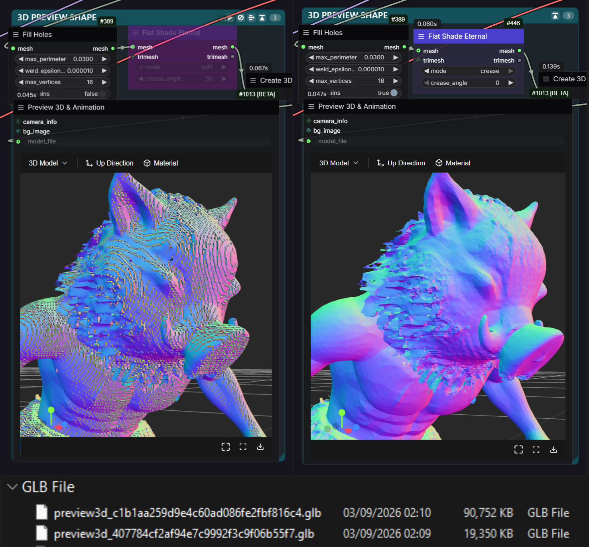

# ComfyUI-ETERNAL-Nodes

Custom ComfyUI nodes by **EternalShade3D** — a single library pack for 3D mesh
repair/bridging, flat-shade control, and image-size picking.

Category prefix on canvas: `⚡ ETERNAL ● ↩ / ...`

Nodes spawn with brand colors: title `#4a3fcf`, body `#2a283e` (recolorable
with any node-color picker afterwards).

## Nodes

| Node | Category | In → Out | Purpose |
|------|----------|----------|---------|
| **Mesh Bridge Eternal** | `🧊 3D / 🕸 Mesh` | in: `mesh` (MESH) + `trimesh` (TRIMESH) [optional] / out: `mesh` (MESH) + `trimesh` (TRIMESH) | ONE node for both. Bridges core `Types.MESH` ↔ `trimesh.Trimesh` (GeomPack). Feed one side, get both back. Merged from old `Mesh to Trimesh Eternal` + `Trimesh to Mesh Eternal`. |
| **Flat Shade Eternal** | `🧊 3D / 🕸 Mesh` | in: `mesh` (MESH) + `trimesh` (TRIMESH) [optional] / out: `mesh` (MESH) + `trimesh` (TRIMESH) | ONE node for both. Shades the mesh FLAT (like Blender `shade_flat()`, with custom split normals cleared). Two GPU modes: `split` (every face own verts — true flat, ~3x verts) or `crease` (only edges sharper than `crease_angle` split — flat hard edges, light file; 0° = split). glTF has no flat-shading state, so splitting is the only way a GLB displays flat. |
| **Trimesh to Model3D Eternal** | `🧊 3D / 🕸 Mesh` | `TRIMESH` → `FILE_3D_GLB` | One-node equivalent of `Trimesh to Mesh Eternal` + `Create 3D File (from Mesh)`. Wires straight into `Preview 3D (Advanced)` `model_3d`. |
| **Preview 3D Eternal** | `🧊 3D / 👁 Preview` | `FILE_3D_*` → viewer | Eternal copy of `Preview 3D & Animation`; previews to TEMP; viewer settings persist per-node into the workflow JSON. |
| **Video Sizes Eternal** | `🔢 Sizes` | (state) → sizes | Aspect-ratio + long-edge picker for text-to-image / video latent sizing. |
| **Aspect Ratio Size Picker** | `🎨 2D / 📐 Size` | → `width`, `height` (INT) | Aspect-ratio dropdown + long-edge slider (64–8192, step 8) + invert toggle. Snaps to multiple of 8. |

## Flat Shade Eternal — mode comparison

Same mesh, same workflow. `split` bakes per-face geometry (flat everywhere,
more vertices); `crease` only splits edges above the angle threshold
(lighter file, flat hard edges).



## Aspect Ratio Size Picker

Pick a target canvas size for an **Empty Latent Image** node from three controls.

### Controls
| Control | Type | Notes |
| --- | --- | --- |
| **Aspect Ratio** | Dropdown | `1:1 (Square)`, `4:3 (Standard)`, `3:2 (Classic 35mm Film)`, `5:4 (Large Format)`, `16:9 (Widescreen)`, `16:10 (Widescreen)` |
| **Long Edge** | Slider (INT) | 64–8192, step 8. Always maps to the larger dimension. |
| **Invert** | Toggle | Swaps the ratio (e.g. `4:3` → `3:4`, `16:9` → `9:16`). |

### Outputs
- `width` (INT)
- `height` (INT)

Both snapped to a multiple of 8 for ComfyUI latent alignment. Wire into an
**Empty Latent Image** node's `width`/`height`.

### Example
```
Aspect Ratio Size Picker ──width──▶ Empty Latent Image
                       └─height─┘
```

## Install

### Manual
```
cd ComfyUI/custom_nodes
git clone https://github.com/EternalShade3D/ComfyUI-ETERNAL-Nodes.git
# restart ComfyUI
```

## License
MIT © EternalShade3D