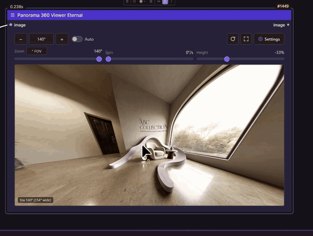
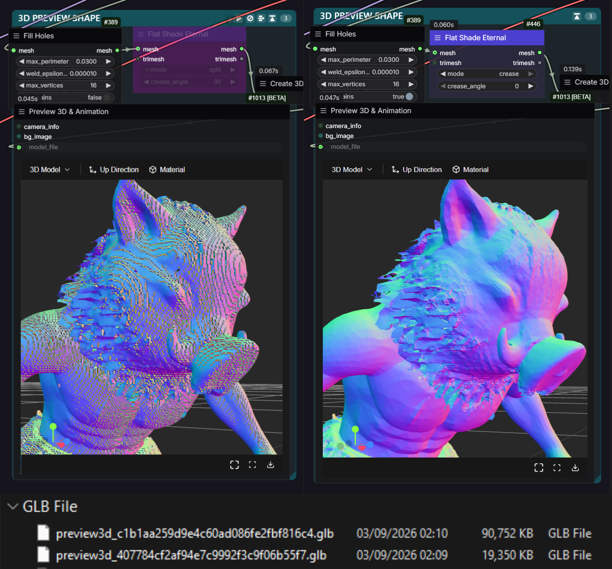

# ComfyUI-ETERNAL-Nodes

Custom ComfyUI nodes by **EternalShade3D** — a single library pack for interactive
360° panorama inspection, 3D mesh repair/bridging, flat-shade control, a tile
pipeline for high-resolution outpainting, and image-size picking.

Category prefix on canvas: `⚡ ETERNAL ● ↩ / ...`

Nodes spawn with brand colors: title `#4a3fcf`, body `#2a283e` (recolorable
with any node-color picker afterwards).

## Repository layout

Mirrors the Pixaroma pack: a thin root, every node in `nodes/`, every front-end file in `js/`.

| Path | What lives there |
|------|------------------|
| `__init__.py` | Registrar only — imports the modules and merges `NODE_CLASS_MAPPINGS` |
| `nodes/` | One module per node (`viewer360.py`, `tile_prepare.py`, `flat_shade.py`, ...) |
| `nodes/_tile_common.py` | Shared tile math (grid planning, positions, overlap) |
| `js/` | Front-end extensions, served to the browser as `WEB_DIRECTORY` |
| `js/shared/` | Reusable UI helpers (panel, settings, node sizing) |
| `docs/` | Reference images kept with the pack |
| `icon.svg` | Pack icon — its URL is published in `pyproject.toml`, so it stays in the root |

## Nodes

| Node | Category | In → Out | Purpose |
|------|----------|----------|---------|
| **Panorama 360 Viewer Eternal** | `🌐 360` | in: `image` (IMAGE) / out: `image` (IMAGE) | Shows an **equirectangular (2:1) 360 image as a WebGL sphere inside the node** — drag to look around, scroll to zoom, optional auto-rotation. Use it to inspect seams, poles and distortion of a panorama. `fov` is the zoom it opens at (100 = usual default; bigger = wider = further away) and the wheel writes the value back, so the view you framed is the view the workflow saves. Settings panel (gear): start yaw/pitch, camera height, exposure, zoom range, wheel/drag speed, horizon guide, background, reset. Image passes through, so it can sit mid-graph. |
| **Mesh Bridge Eternal** | `🧊 3D` | in: `mesh` (MESH) + `trimesh` (TRIMESH) [optional] / out: `mesh` (MESH) + `trimesh` (TRIMESH) | ONE node for both. Bridges core `Types.MESH` ↔ `trimesh.Trimesh` (GeomPack). Feed one side, get both back. Merged from old `Mesh to Trimesh Eternal` + `Trimesh to Mesh Eternal`. |
| **Flat Shade Eternal** | `🧊 3D` | in: `mesh` (MESH) + `trimesh` (TRIMESH) [optional] / out: `mesh` (MESH) + `trimesh` (TRIMESH) | ONE node for both. Shades the mesh FLAT (like Blender `shade_flat()`, with custom split normals cleared). Two GPU modes: `split` (every face own verts — true flat, ~3x verts) or `crease` (only edges sharper than `crease_angle` split — flat hard edges, light file; 0° = split). glTF has no flat-shading state, so splitting is the only way a GLB displays flat. |
| **Trimesh to Model3D Eternal** | `🧊 3D` | `TRIMESH` → `FILE_3D_GLB` | One-node equivalent of `Trimesh to Mesh Eternal` + `Create 3D File (from Mesh)`. Wires straight into `Preview 3D (Advanced)` `model_3d`. |
| **Preview 3D Eternal** | `🧊 3D` | `FILE_3D_*` → viewer | Eternal copy of `Preview 3D & Animation`; previews to TEMP; viewer settings persist per-node into the workflow JSON. |
| **Video Sizes Eternal** | `🔢 Sizes` | (state) → sizes | Aspect-ratio + long-edge picker for text-to-image / video latent sizing. |
| **Aspect Ratio Size Picker** | `🔢 Sizes` | → `width`, `height` (INT) | Aspect-ratio dropdown + long-edge slider (64–8192, step 8) + invert toggle. Snaps to multiple of 8. |
| **TILE PREPARE ETERNAL** | `🧩 Tiles` | in: `IMAGE` / out: `IMAGE` + per-tile `IMAGE`s, `MASK`s, `INT` count | The modern entry point for tile work: plans the grid and emits the whole crop as one image for the sampler plus a list of individual tiles. Replaces the old GRID + SPLIT + TILES chain. `mode`: Auto (squarest) / Total tiles / Manual rows×cols. `target_tile` 1024, `overlap` 128. |
| **TILE STITCH ETERNAL** | `🧩 Tiles` | in: `IMAGE` list + `source_w`/`source_h`/`tile_width`/`tile_height`/`rows`/`cols`/`overlap_x`/`overlap_y` / out: `IMAGE` | Stitches the processed tiles back into one image, blending the overlaps. |
| **TILE PROMPT PANEL ETERNAL** | `🧩 Tiles` | in: `IMAGE`, `rows`, `cols` / out: `STRING` tile text, `IMAGE` overlay, `STRING` JSON | One panel to hold a per-tile prompt list, so the tile nodes can drive a sampler per tile. Wire `auto_prompts` (VL-written lines) or `whole_image_prompt` (what the whole picture is). |
| **PROMPT FOR TILE #N ETERNAL** | `🧩 Tiles` | in: `index` (INT), `combine`, `use_global`, `tile_prompts`, `vl_prompt`, `global_prompt` / out: `STRING` ×2 | Picks the prompt for tile #N. `combine` decides whether your manual text or the VL caption wins. Replaces the old PER-TILE PROMPT node. |

### 🗄 `_archive` — kept only so old workflows still load

Five nodes are superseded. They stay registered on purpose, under `🗄 _archive`,
and each one's **name points at its replacement**, so you can see the migration
at the point of confusion:

| Archived node | Use instead |
| --- | --- |
| `(old) TILE GRID` | **TILE PREPARE** |
| `(old) TILE SPLIT` | **TILE PREPARE** |
| `(old) TILES → VL` | **TILE PREPARE** (it has a `tile` output) |
| `(old) PER-TILE PROMPT` | **PROMPT FOR TILE #N** |
| `(old) VL PROMPTS → PANEL` | **TILE PROMPT PANEL** (wire `auto_prompts`) |

## Panorama 360 Viewer Eternal

The node that makes this release: inspect a 360° panorama without leaving your
workflow or opening a browser tab.

### See it in action



*Live preview — drag the sphere, scroll to zoom. The node title, `FOV`,
`Spin` and `Height` controls are all real, not a mock-up.*

📥 **Full 60-second recording (1080p):**
[download `panorama360_viewer_demo.mp4`](https://github.com/EternalShade3D/ComfyUI-ETERNAL-Nodes/releases/download/v1.1.0/panorama360_viewer_demo.mp4)
— also attached to the [v1.1.0 release](https://github.com/EternalShade3D/ComfyUI-ETERNAL-Nodes/releases/tag/v1.1.0).

> **Why a GIF and not the video?** GitHub serves README media as
> `application/octet-stream` and strips `<video>` tags, and its file viewer
> refuses anything over 10 MB — it answers *"we can't show files that are
> this big right now."* An animated GIF is the only thing that actually
> plays on the repo page, so that is what leads here. The MP4 above is the
> full-quality version if you want the whole minute.

### How to use
1. Wire any image into `image` (it must be **equirectangular, 2:1**).
2. Run the workflow — the sphere builds inside the node.
3. **Drag** to look around, **scroll** to zoom, set `auto_rotate` to drift.
4. The gear button opens settings: start yaw/pitch, camera height, exposure,
   zoom range, wheel/drag speed, horizon guide, background, reset.

### Controls
| Control | Type | Notes |
| --- | --- | --- |
| **image** | IMAGE | Equirectangular 360 image (2:1). |
| **frame_index** | INT | Which image of a batch to view (0 = first). |
| **fov** | INT | 30–140, default **100**. The zoom it opens at: bigger = wider = further away. The wheel changes it live and writes it back. |
| **auto_rotate** | FLOAT | Degrees per second (0 = off), 0–60. Pauses while you drag. |
| **background** | COMBO | `dark` / `black` / `grey` / `light` — the colour behind the sphere. |
| **exposure** | FLOAT | 0.2–3.0, default 1.0. Viewer brightness only; never touches the image on the wire. |
| **start_yaw** | FLOAT | 0–360, default 180. Where it opens horizontally (0/360 = left edge, 180 = middle). |
| **start_pitch** | FLOAT | −90–90, default 0. 0 = horizon centred, negative = looking down. |
| **z_offset** | FLOAT | −99–99. Camera height on the vertical axis, as a % of the sphere radius. A translation, not a tilt. |

### Notes
- **Needs internet once** to fetch three.js (~600 KB), browser-cached after.
- The image **passes through** to `image` output, so the viewer can sit in the
  middle of a graph instead of ending it.
- Search aliases: `360`, `panorama`, `equirectangular`, `sphere`, `vr`.

## Flat Shade Eternal — mode comparison

Same mesh, same workflow. `split` bakes per-face geometry (flat everywhere,
more vertices); `crease` only splits edges above the angle threshold
(lighter file, flat hard edges).



## Aspect Ratio Size Picker

Pick a target canvas size for an **Empty Latent Image** node from three controls.

### Controls
| Control | Type | Notes |
| --- | --- | --- |
| **Aspect Ratio** | Dropdown | `1:1 (Square)`, `4:3 (Standard)`, `3:2 (Classic 35mm Film)`, `5:4 (Large Format)`, `16:9 (Widescreen)`, `16:10 (Widescreen)` |
| **Long Edge** | Slider (INT) | 64–8192, step 8. Always maps to the larger dimension. |
| **Invert** | Toggle | Swaps the ratio (e.g. `4:3` → `3:4`, `16:9` → `9:16`). |

### Outputs
- `width` (INT)
- `height` (INT)

Both snapped to a multiple of 8 for ComfyUI latent alignment. Wire into an
**Empty Latent Image** node's `width`/`height`.

### Example
```
Aspect Ratio Size Picker ──width──▶ Empty Latent Image
                       └─height─┘
```

## Install

### Manual
```
cd ComfyUI/custom_nodes
git clone https://github.com/EternalShade3D/ComfyUI-ETERNAL-Nodes.git
# restart ComfyUI
```

## License
MIT © EternalShade3D